<p align="center">
  
</p>

<p align="center">
  <a href="https://github.com/svssathvik7/turbine/actions/workflows/ci.yml">
    
  </a>
  <a href="https://crates.io/crates/turbine-rpc-proxy">
    
  </a>
  <a href="https://hub.docker.com/r/svssathvik7/turbine">
    
  </a>
  <a href="LICENSE">
    
  </a>
  <a href="https://github.com/svssathvik7/turbine">
    
  </a>
</p>

<br/>

<p align="center">
  <b>The RPC proxy that works for every chain — not just EVM.</b><br/>
  <sub>Intelligent endpoint rotation · Hedged requests · Live dashboard · Written in Rust</sub>
</p>

<br/>

---

## Why Turbine?

<table>
<tr>
<td width="33%" valign="top">

### 🌐 Any chain
Bitcoin, Solana, Ethereum, Starknet — if it speaks JSON-RPC over HTTP, Turbine handles it. Auto-detects health methods per chain. No EVM lock-in.

</td>
<td width="33%" valign="top">

### 🎯 Method routing
Pin `eth_sendRawTransaction` to a private mempool while everything else round-robins. Per-endpoint method allowlists. Nothing else does this.

</td>
<td width="33%" valign="top">

### ⚡ Hedged requests
Fire parallel speculative requests after N ms. First response wins. **35× lower p99 latency**, implemented with `FuturesUnordered` for zero wasted overhead.

</td>
</tr>
<tr>
<td width="33%" valign="top">

### 🔒 API key auth
Require clients to authenticate via `Authorization: Bearer` or `X-Api-Key`. Per-key rate limits. Auth/metrics/dashboard routes stay open.

</td>
<td width="33%" valign="top">

### 📦 Embeddable library
`turbine.into_router()` returns an axum `Router`. Drop it into your existing service — no sidecar required.

</td>
<td width="33%" valign="top">

### 📡 WebSocket proxy
Relay WS subscriptions to upstream WSS endpoints. Automatic reconnection, auth injection, and fallback to alternate endpoints on disconnect.

</td>
</tr>
</table>

---

## How It Works

<p align="center">
  
</p>

Every inbound request flows through six stages. The glowing packet shows the hot path — most requests resolve at the **CACHE** stage without ever hitting an upstream node.

| Stage | What happens |
|---|---|
| **AUTH** | Validates `Authorization: Bearer` / `X-Api-Key` if keys are configured. Returns `401` on failure. |
| **ROUTE** | Matches path name (`/ethereum`) or EVM chain ID (`/1`, `/8453`). Returns `404` for unknown chains. |
| **LIMIT** | Token-bucket rate limiter per chain (and per API key). Returns `429` on overflow. |
| **CACHE** | Checks in-process LRU cache keyed by method + params. Returns cached response immediately on hit. |
| **POOL** | Picks a healthy endpoint using round-robin, weighted, or latency-based rotation. Skips unhealthy endpoints; falls back to least-recently-failed if all are down. |
| **HEDGE** | Forwards to the selected endpoint. After `delay_ms`, fires up to `max_count` parallel hedge requests to alternate endpoints. First success wins. Failed requests retry up to `max_retries` times. |

> **Background health checker:** polls block height on every endpoint every `health_check_interval_seconds`. Endpoints lagging more than `max_block_lag` blocks are automatically marked stale and skipped.

---

## Benchmarks

<p align="center">
  
</p>

Measured on Ethereum Sepolia, comparing v0.10.0 (mutex-based) vs v1.0.0 (lock-free atomics + `FuturesUnordered` hedging):

| Scenario | Metric | v0.10.0 | v1.0.0 | Δ |
|---|---|---|---|---|
| 50 concurrent | Throughput | 9.6 req/s | **123+ req/s** | 🚀 **12.9×** |
| 50 concurrent | p99 latency | 19.9 s | **0.57 s** | 🚀 **35×** |
| 100 concurrent | Throughput | 197 req/s | **245 req/s** | ↑ 1.25× |
| 100 concurrent | p99 latency | 1.49 s | **0.78 s** | ↑ 1.9× |

Key changes: per-field atomics (`AtomicBool`, `AtomicU32`, `AtomicU64`) replaced `RwLock<Vec<EndpointHealth>>`, eliminating all read contention on the hot path. HTTP client tuned with connection pooling, TCP keepalive, and a single shared `reqwest::Client` across all chains.

---

## Quick Start

### CLI

```bash
cargo install turbine-rpc-proxy
turbine --config config.toml
turbine --config config.toml --port 9090 --log-level debug
```

### Docker

```bash
docker run -p 8080:8080 \
  -v $(pwd)/config.toml:/config.toml \
  svssathvik7/turbine
```

### Library

```rust
use turbine::Turbine;

#[tokio::main]
async fn main() {
    let turbine = Turbine::builder()
        .add_chain("ethereum")
            .endpoint("https://eth.llamarpc.com")
            .endpoint("https://rpc.ankr.com/eth")
            .endpoint_with_header("https://rpc.quicknode.com", "x-api-key", "YOUR_KEY")
            .latency_based()
            .cache(true).cache_preset("evm")
            .hedge(300, 2)
            .done()
        .add_chain("bitcoin")
            .endpoint_with_basic_auth("http://node:8332", "rpcuser", "pass")
            .done()
        .build()
        .unwrap();

    turbine.serve("127.0.0.1:8080").await.unwrap();
}
```

Embed in an existing axum app:

```rust
let router = Turbine::from_config("config.toml".as_ref())
    .unwrap()
    .into_router();
// merge with your own routes, add middleware, etc.
```

---

## Configuration

<details>
<summary><b>Full config.toml example (click to expand)</b></summary>

```toml
[server]
host = "127.0.0.1"
port = 8080
dashboard_secret = "my-secret"   # dashboard at /my-secret (omit to disable)

[[server.api_keys]]
name = "internal"
key  = "sk_internal_abc123"

[[server.api_keys]]
name = "partner"
key  = "sk_partner_xyz789"
[server.api_keys.rate_limit]
max_requests   = 500
window_seconds = 60

# ─── Ethereum ──────────────────────────────────────────────
[[chains]]
name     = "ethereum"
route    = "/ethereum"
chain_id = 1
rotation = "latency"
endpoints = [
    "https://eth.llamarpc.com",
    { url = "https://rpc.ankr.com/eth", weight = 2 },
    { url = "https://rpc.quicknode.com", weight = 3,
      auth = { header = { name = "x-api-key", value = "key-123" } } },
    # private mempool — only receives eth_sendRawTransaction
    { url = "https://private-mempool.example.com",
      methods = ["eth_sendRawTransaction"] },
]

[chains.health]
max_consecutive_failures      = 3
cooldown_seconds              = 30
health_check_interval_seconds = 15
max_block_lag                 = 10
max_retries                   = 2
retry_delay_ms                = 100

[chains.rate_limit]
max_requests   = 100
window_seconds = 60

[chains.hedge]
delay_ms  = 300
max_count = 2

[chains.cache]
enabled      = true
preset       = "evm"
max_capacity = 10000

[[chains.cache.methods]]
name        = "eth_blockNumber"
ttl_seconds = 5

# ─── Bitcoin ───────────────────────────────────────────────
[[chains]]
name  = "bitcoin"
route = "/bitcoin"
endpoints = [
    { url = "http://node1:8332",
      auth = { basic = { username = "rpcuser", password = "pass1" } } },
    { url = "http://node2:8332",
      auth = { basic = { username = "rpcuser", password = "pass2" } } },
]
[chains.health]
health_method = "getblockcount"

# ─── Solana ────────────────────────────────────────────────
[[chains]]
name     = "solana"
route    = "/solana"
rotation = "weighted"
endpoints = [
    { url = "https://api.mainnet-beta.solana.com", weight = 3 },
    { url = "https://rpc.ankr.com/solana",         weight = 1 },
]
[chains.health]
health_method                 = "getSlot"
health_check_interval_seconds = 15
max_block_lag                 = 50
[chains.cache]
enabled = true
preset  = "solana"
```

</details>

<details>
<summary><b>Configuration reference (click to expand)</b></summary>

### `[server]`

| Field | Type | Description |
|---|---|---|
| `host` | string | Bind address |
| `port` | integer | Port number |
| `dashboard_secret` | string | Secret path for live dashboard (omit to disable) |

### `[[server.api_keys]]`

When any keys are configured, all `/{chain}` requests require `Authorization: Bearer <key>` or `X-Api-Key: <key>`.

| Field | Type | Description |
|---|---|---|
| `name` | string | Label used in logs |
| `key` | string | Secret key clients must present |
| `[rate_limit]` | object | Optional per-key quota (see `[chains.rate_limit]`) |

### `[[chains]]`

| Field | Default | Description |
|---|---|---|
| `name` | required | Chain identifier |
| `route` | required | HTTP path (`/ethereum`) |
| `chain_id` | — | EVM chain ID for numeric routing (`/1`, `/8453`) |
| `rotation` | `round_robin` | `round_robin`, `weighted`, or `latency` |
| `endpoints` | required | Array of URL strings or endpoint objects |

### Endpoint object

```toml
{ url = "https://...", weight = 3, ws_url = "wss://...",
  methods = ["eth_sendRawTransaction"],
  auth = { header = { name = "x-api-key", value = "..." } } }
```

| Auth type | Config |
|---|---|
| Basic Auth | `{ basic = { username, password } }` |
| Bearer token | `{ bearer = "token" }` |
| Custom header | `{ header = { name, value } }` |

### `[chains.health]`

| Field | Default | Description |
|---|---|---|
| `max_consecutive_failures` | `3` | Failures before marking unhealthy |
| `cooldown_seconds` | `30` | Wait before retrying unhealthy endpoint |
| `health_check_interval_seconds` | `30` | Background poll interval |
| `max_block_lag` | `10` | Blocks behind before marked stale |
| `health_method` | auto | Auto-detected: EVM→`eth_blockNumber`, BTC→`getblockcount`, Solana→`getSlot`, Starknet→`starknet_blockNumber` |
| `max_retries` | `1` | Retry attempts on failure |
| `retry_delay_ms` | `0` | ms between retries |

### `[chains.cache]`

| Field | Default | Description |
|---|---|---|
| `enabled` | `false` | Enable caching |
| `preset` | — | `"evm"` or `"solana"` — loads sensible default TTLs |
| `max_capacity` | `10000` | Max cached entries |

**EVM preset:** `eth_chainId`/`net_version` (24h), block/tx/receipt/code methods (5m)

**Solana preset:** `getGenesisHash` (24h), `getVersion` (1h), `getBlock`/`getTransaction` (5m)

### `[chains.hedge]`

| Field | Description |
|---|---|
| `delay_ms` | Fire hedge after this many ms with no response |
| `max_count` | Max additional parallel requests (default `1`) |

### `[chains.rate_limit]`

| Field | Description |
|---|---|
| `max_requests` | Max requests per window |
| `window_seconds` | Window size in seconds |

</details>

---

## Usage

```bash
# Basic request
curl -X POST http://localhost:8080/ethereum \
  -H "Content-Type: application/json" \
  -d '{"jsonrpc":"2.0","method":"eth_blockNumber","params":[],"id":1}'

# Route by chain ID
curl -X POST http://localhost:8080/1 \
  -H "Content-Type: application/json" \
  -d '{"jsonrpc":"2.0","method":"eth_blockNumber","params":[],"id":1}'

# Batch
curl -X POST http://localhost:8080/ethereum \
  -H "Content-Type: application/json" \
  -d '[{"jsonrpc":"2.0","method":"eth_blockNumber","params":[],"id":1},
       {"jsonrpc":"2.0","method":"eth_chainId","params":[],"id":2}]'

# With API key
curl -X POST http://localhost:8080/ethereum \
  -H "X-Api-Key: sk_abc123" \
  -H "Content-Type: application/json" \
  -d '{"jsonrpc":"2.0","method":"eth_blockNumber","params":[],"id":1}'

# WebSocket
wscat -c ws://localhost:8080/ethereum

# Metrics / status / dashboard
curl http://localhost:8080/metrics
curl http://localhost:8080/api/status
open http://localhost:8080/my-secret   # replace with your dashboard_secret
```

---

## Dashboard

Set `dashboard_secret = "my-secret"` in `[server]` to enable the live dashboard at `GET /my-secret`. Auto-refreshes every 5 seconds.

- **Global** — total requests, success rate, active chains, cache hit rate
- **Per-chain** — request stats, success rate bars, endpoint health at a glance
- **Per-endpoint** — URL, health status, rolling latency, block height, request/success/failure counts
- **Health** — 🟢 healthy · 🟡 degraded · 🔴 all down

The `/`, `/metrics`, and `/api/status` routes are always open (no auth required).

---

## Monitoring

| Endpoint | Description |
|---|---|
| `GET /` | Health summary as JSON |
| `GET /metrics` | Compact per-chain aggregate stats |
| `GET /api/status` | Full per-endpoint telemetry (latency, block height, counters) |
| `GET /{secret}` | Live web dashboard |

---

## Contributing

Issues, PRs, and feedback are very welcome.

```bash
git clone https://github.com/svssathvik7/turbine
cd turbine
cargo build
cargo run -- --config testnet.config.toml
bash bench.sh   # run benchmarks
```

No ceremony — open a PR and we'll iterate.

---

<p align="center">
  <sub>MIT License · <a href="https://crates.io/crates/turbine-rpc-proxy">crates.io</a> · <a href="https://hub.docker.com/r/svssathvik7/turbine">Docker Hub</a> · <a href="https://docs.rs/turbine-rpc-proxy">docs.rs</a></sub>
</p>
